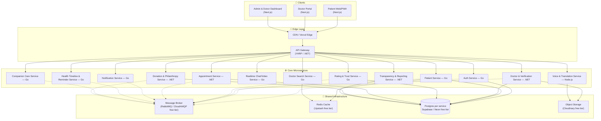
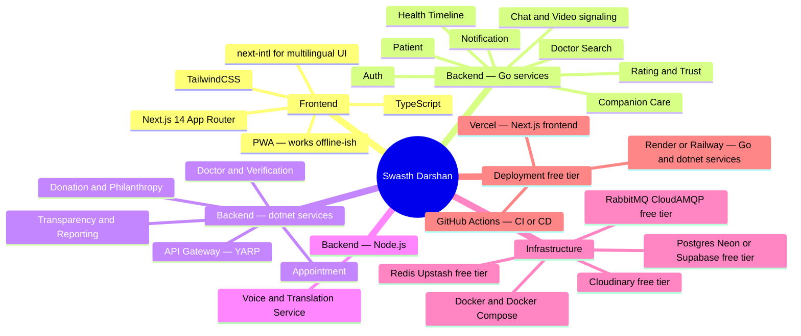
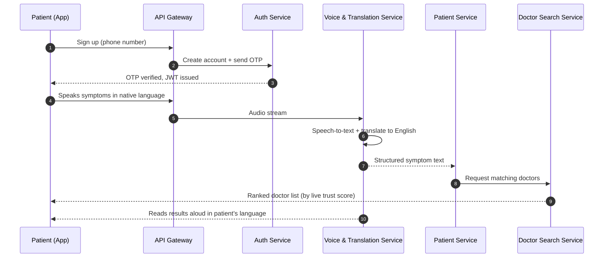
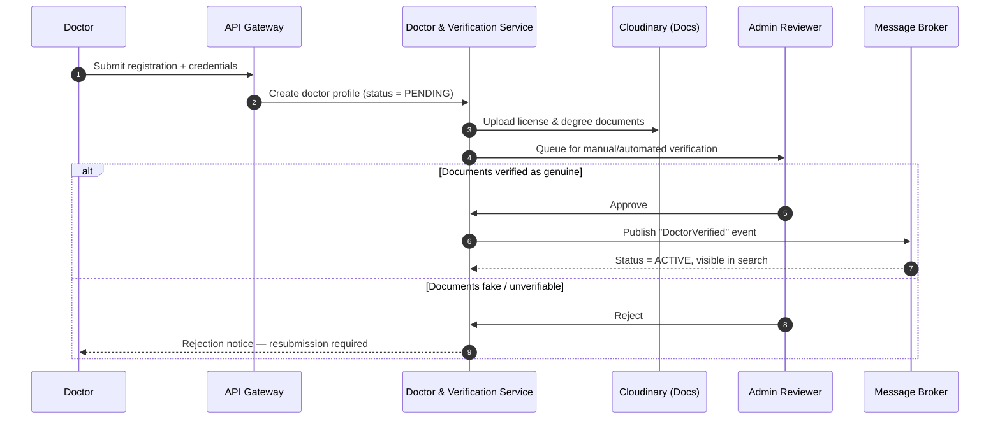
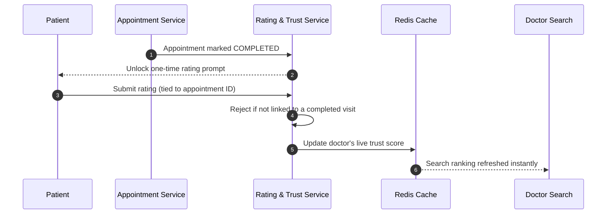
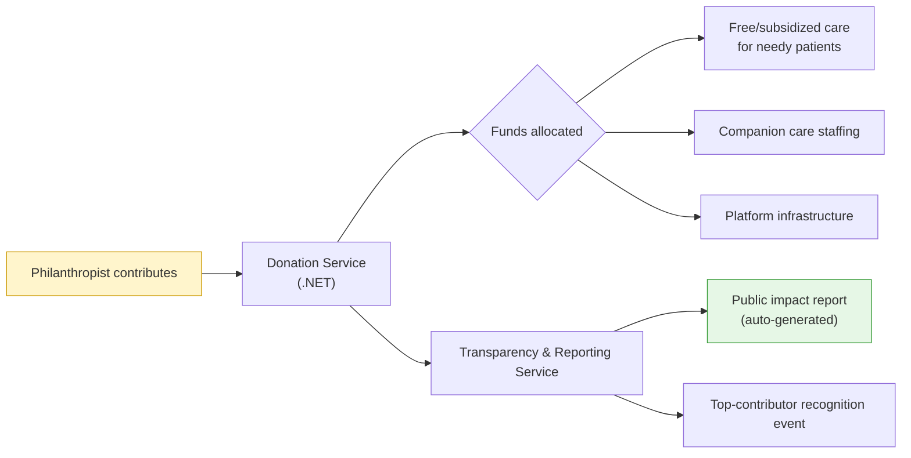
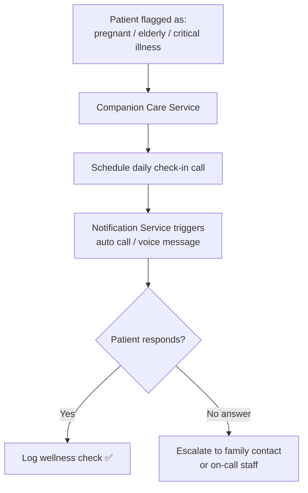
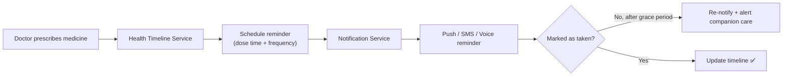
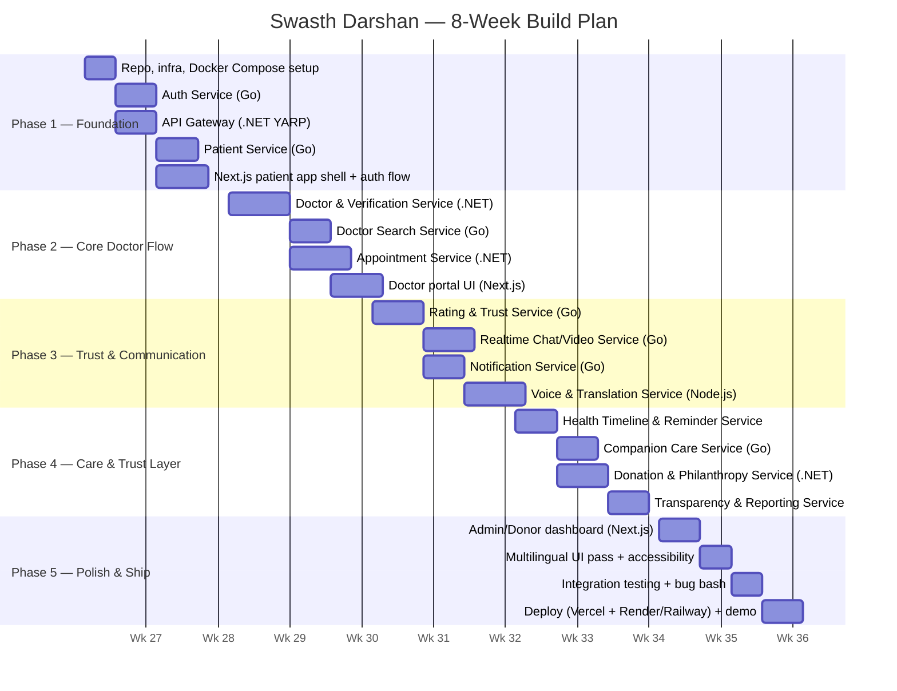

# 🩺 Swasth Darshan — Voice-First Healthcare Platform for Bharat

<div align="center">

**Connecting patients and doctors through a trust-first, multilingual, voice-enabled healthcare network — funded by philanthropy, not politics.**


[Vision](#-vision) • [Architecture](#-system-architecture) • [Services](#-microservices-breakdown) • [Tech Stack](#-tech-stack) • [Flows](#-core-flows) • [Getting Started](#-getting-started) • [2-Month Plan](#-2-month-implementation-plan)

</div>

---

## 📖 Vision

Healthcare access in India is broken for the people who need it most — elderly patients, less-literate patients, pregnant women, and anyone in a rural or underserved area who can't navigate an app built for someone else.

**Swasth Darshan** fixes this by being:

- 🗣️ **Voice-first & multilingual** — patients who can't read or type can *speak* their symptoms in their own language.
- ⭐ **Trust-first doctor discovery** — doctors are ranked purely by **real-time, unpaid, tamper-proof ratings**. No sponsored placements. No "top doctor" ads.
- 🛡️ **Verified-only doctors** — every doctor must submit proven credentials before they can register. Fake records are rejected outright.
- 💛 **Philanthropy-funded, not government-funded** — we take no government or political money, so there's no political interference. We're funded transparently by philanthropists, with public reports on where every rupee goes.
- 🤝 **Companion care** — pregnant women, elderly patients, and patients with serious illnesses get **daily check-in calls** so no one feels alone.
- ⏰ **Health timelines** — automated medicine reminders so patients never miss a dose.
- 🎨 **Radically simple UI** — built for a first-time smartphone user, not a power user.

This README documents the **full microservices architecture** — designed to scale from a hackathon prototype to a real SaaS product.

---

## 🏗️ System Architecture

### High-Level Overview



> **Why this shape?** Every service owns its own database (database-per-service), talks to the outside world only through the API Gateway, and communicates with other services asynchronously over the message broker wherever the operation doesn't need an instant response (e.g. "send a reminder", "recalculate rating"). This keeps services independently deployable and stops one team's bug from taking down the whole platform.

---

## 🧩 Microservices Breakdown

| # | Service | Why this stack | Core Responsibility | Free-Tier Tools Used |
|---|---------|----------------|----------------------|------------------------|
| 1 | **Auth Service** | **Go** — tiny, fast, cheap to run at high concurrency for login/token traffic | Signup, login, OTP verification, JWT issuing, refresh tokens, RBAC (patient/doctor/admin/donor) | Firebase Auth (free tier) or self-hosted OTP via free SMS API (Fast2SMS free credits) |
| 2 | **Patient Service** | **Go** — simple CRUD, high read volume | Patient profiles, preferred language, accessibility settings (voice-first mode, font size) | Neon/Supabase Postgres free tier |
| 3 | **Doctor & Verification Service** | **.NET / C#** — strong typing & workflow engine suits multi-step KYC approval logic well | Doctor onboarding, document upload, credential verification workflow, "no fake records" enforcement, approval state machine | Cloudinary free tier (document storage), manual/admin approval queue |
| 4 | **Rating & Trust Service** | **Go** — needs to process rating events fast and in real time | Collects only **post-consultation, unpaid** ratings, detects and blocks fake/bulk ratings, computes real-time doctor trust score | Redis (Upstash) for real-time score cache |
| 5 | **Appointment Service** | **.NET / C#** — transactional integrity for booking/cancellation logic | Doctor availability, slot booking, rescheduling, cancellations | Postgres free tier |
| 6 | **Realtime Chat / Video Service** | **Go** — goroutines make it ideal for thousands of concurrent WebSocket connections | Patient↔doctor chat, video consultation signaling | Free tier: Daily.co / Jitsi (self-hosted, free), WebSocket via Go `gorilla/websocket` |
| 7 | **Notification Service** | **Go** — lightweight fan-out worker | Push, SMS, and voice-call notifications; consumes events from the bus | Firebase Cloud Messaging (free), Twilio free trial credits |
| 8 | **Health Timeline & Reminder Service** | **Go** — cron-like scheduling at scale | Builds each patient's health timeline, schedules medicine reminders, escalates missed doses | Postgres + Go `cron` scheduler |
| 9 | **Companion Care Service** | **Go** — scheduling + queue-driven | Flags pregnant/elderly/critical-illness patients for **daily check-in calls**, assigns volunteers/staff, tracks "no loneliness" streaks | Twilio Voice free trial for auto-call scheduling |
| 10 | **Voice & Translation Service** | **Node.js** — best ecosystem for speech & translation SDKs | Speech-to-text and text-to-speech for less-literate/elderly patients, multilingual translation of the entire app | Web Speech API (free, browser-native), LibreTranslate (free/open-source), Google Cloud Translate free tier |
| 11 | **Donation & Philanthropy Service** | **.NET / C#** — financial-grade reliability and auditability | Accepts philanthropist contributions, tracks fund allocation, generates public transparency reports, recognizes top contributors | Razorpay/Stripe **test mode** (free), Postgres |
| 12 | **Transparency & Reporting Service** | **.NET / C#** — reporting/aggregation jobs | Publishes where donated money is spent, auto-generates public impact reports & contributor recognition events | Postgres + scheduled jobs |
| 13 | **Doctor Search & Discovery Service** | **Go** — fast full-text + geo search | Search doctors by specialty, language, location, and **live trust score**, never by "who paid more" | Meilisearch free/open-source (self-hosted) or Postgres full-text search |
| 14 | **API Gateway** | **.NET (YARP)** | Single entry point, auth middleware, rate limiting, request routing to all services | — |

> 🔑 **The "no fake ratings, no fake records" rule** is enforced at two layers: the **Doctor Service** rejects unverifiable credentials at onboarding, and the **Rating Service** only accepts a rating event that's tied to a *completed, verified appointment* — so ratings can't be bought or bulk-submitted.

---

## 🛠️ Tech Stack



---

## 🔀 Core Flows

### 1️⃣ Patient onboarding & voice-first symptom intake



### 2️⃣ Doctor onboarding — "no fake records" verification



### 3️⃣ Real-time, unpaid doctor rating



### 4️⃣ Philanthropy funding & transparency loop



### 5️⃣ Companion care — "no loneliness" daily check-ins



### 6️⃣ Health timeline & medicine reminders



---

## 📂 Repository Structure

```
swasth-darshan/
├── frontend/
│   ├── patient-app/           # Next.js — patient-facing PWA
│   ├── doctor-portal/         # Next.js — doctor dashboard
│   └── admin-donor-dashboard/ # Next.js — admin + transparency reports
│
├── services/
│   ├── go/
│   │   ├── auth-service/
│   │   ├── patient-service/
│   │   ├── rating-service/
│   │   ├── chat-video-service/
│   │   ├── notification-service/
│   │   ├── health-timeline-service/
│   │   ├── companion-care-service/
│   │   └── doctor-search-service/
│   │
│   ├── dotnet/
│   │   ├── ApiGateway/                 # YARP reverse proxy
│   │   ├── DoctorVerificationService/
│   │   ├── AppointmentService/
│   │   ├── DonationService/
│   │   └── TransparencyReportingService/
│   │
│   └── node/
│       └── voice-translation-service/
│
├── infra/
│   ├── docker-compose.yml     # spins up every service + Postgres + Redis + RabbitMQ locally
│   ├── k8s/                   # optional Kubernetes manifests for later scale
│   └── github-actions/        # CI/CD pipelines per service
│
└── docs/
    ├── architecture/
    └── api-contracts/
```

---

## 🚀 Getting Started

### Prerequisites

- Node.js ≥ 20, Go ≥ 1.22, .NET SDK ≥ 8
- Docker & Docker Compose
- Free-tier accounts: [Supabase](https://supabase.com), [Upstash](https://upstash.com), [CloudAMQP](https://cloudamqp.com), [Cloudinary](https://cloudinary.com)

### Local setup (one command)

```bash
git clone https://github.com/<your-org>/swasth-darshan.git
cd swasth-darshan
cp .env.example .env          # fill in free-tier API keys
docker compose -f infra/docker-compose.yml up --build
```

This spins up:

| Component | URL |
|---|---|
| Patient App | http://localhost:3000 |
| Doctor Portal | http://localhost:3001 |
| Admin/Donor Dashboard | http://localhost:3002 |
| API Gateway | http://localhost:5000 |
| RabbitMQ Console | http://localhost:15672 |

### Running a single service (during development)

```bash
# Go service
cd services/go/rating-service && go run .

# .NET service
cd services/dotnet/AppointmentService && dotnet run

# Node service
cd services/node/voice-translation-service && npm run dev
```

---

## 🎯 Design Principles

1. **Trust over virality** — no paid rankings, ever. The rating algorithm has no "boost" parameter.
2. **Accessibility is not an afterthought** — voice-first and multilingual support is a first-class citizen in the architecture (its own dedicated service), not a UI toggle bolted on later.
3. **Every rupee is traceable** — the Transparency Service exists solely to make fund flow public and auditable.
4. **No single point of political control** — funding model is deliberately philanthropy-only.
5. **Independently scalable** — each service can be scaled, redeployed, or rewritten without touching the others.

---

## 🗓️ 2-Month Implementation Plan

Built to take **Swasth Darshan** from an empty repo to a fully-demoable SaaS product in **8 weeks**, solo-developer-friendly, using only free-tier infra.

### Timeline at a glance



### Week-by-week breakdown

#### 🧱 Phase 1 — Foundation (Week 1–2)
| Days | Task | Deliverable |
|---|---|---|
| 1–3 | Set up monorepo, Docker Compose, free-tier accounts (Supabase, Upstash, CloudAMQP, Cloudinary) | `docker compose up` boots empty skeleton |
| 4–7 | Build **Auth Service** (Go) + **API Gateway** (.NET YARP) in parallel | OTP login working end-to-end |
| 8–11 | Build **Patient Service** (Go) + Next.js patient app shell (auth pages, profile) | Patient can sign up, set language/accessibility prefs |
| 12–14 | Wire gateway routing + JWT middleware, deploy skeleton to Vercel/Render | Public URL, login works in the cloud |

**Milestone:** Patient can sign up, log in, and land on an (empty) dashboard — deployed and demoable.

#### 🩺 Phase 2 — Core Doctor Flow (Week 3–4)
| Days | Task | Deliverable |
|---|---|---|
| 15–20 | Build **Doctor & Verification Service** (.NET) — profile, document upload, approval state machine | Doctor can register; admin can approve/reject |
| 21–24 | Build **Doctor Search Service** (Go) with Postgres full-text/Meilisearch | Patients can search doctors by specialty/language |
| 25–30 | Build **Appointment Service** (.NET) — slots, booking, cancellation | End-to-end booking flow works |
| 31–35 | Build Doctor Portal (Next.js) — profile, document upload UI, appointment calendar | Doctor-side UI fully usable |

**Milestone:** A verified doctor can be discovered and booked by a patient.

#### ⭐ Phase 3 — Trust & Communication (Week 5–6)
| Days | Task | Deliverable |
|---|---|---|
| 36–40 | Build **Rating & Trust Service** (Go) — post-appointment-only rating, live score in Redis | Ratings unlock only after a completed visit |
| 41–45 | Build **Chat/Video Service** (Go) with WebSockets + Jitsi/Daily.co free tier | Patient↔doctor chat + video call works |
| 46–49 | Build **Notification Service** (Go) — push/SMS via Firebase + Twilio trial | Booking confirmations, reminders fire correctly |
| 50–55 | Build **Voice & Translation Service** (Node.js) — Web Speech API + LibreTranslate, wire into patient app | Patient can speak symptoms in Hindi/regional language |

**Milestone:** Full consultation loop — search, book, chat/video, rate — works in multiple languages.

#### 💛 Phase 4 — Care & Trust Layer (Week 7)
| Days | Task | Deliverable |
|---|---|---|
| 56–59 | Build **Health Timeline & Reminder Service** (Go) — prescriptions → scheduled reminders | Medicine reminders fire on time |
| 60–63 | Build **Companion Care Service** (Go) — flag pregnant/elderly/critical patients, schedule daily check-ins | Daily check-in calls scheduled + logged |
| 64–68 | Build **Donation Service** (.NET) with Razorpay/Stripe test mode | Philanthropist can "donate" in test mode |
| 69–72 | Build **Transparency & Reporting Service** (.NET) — auto-generate public impact reports | Public report page shows fund allocation |

**Milestone:** The "no loneliness" and "transparent funding" promises are live features, not just slides.

#### 🚀 Phase 5 — Polish & Ship (Week 8)
| Days | Task | Deliverable |
|---|---|---|
| 73–76 | Build Admin/Donor Dashboard (Next.js) — approvals queue, transparency view, contributor recognition | Single pane of glass for admins/donors |
| 77–79 | Full multilingual + accessibility pass (large fonts, voice navigation, simplified UI mode) | App usable by a non-literate/elderly test user |
| 80–82 | Integration testing, load-test with free-tier limits in mind, fix bugs | Stable demo build |
| 83–86 | Final deploy, README polish, record demo video, resume-ready write-up | 🎉 **Live, working SaaS product** |

**Milestone:** A complete, deployed, demoable healthcare SaaS platform — built solo in 2 months.

### Suggested weekly time budget (for a solo student developer)
- **Weekdays:** 3–4 focused hours/day on the current phase's services
- **Weekends:** 1 day for integration + testing, 1 day buffer for catching up
- This plan assumes ~25–30 hours/week — adjust phase lengths if your available time is lower or higher.

### Post-Week-8 stretch goals (optional, if ahead of schedule)
- [ ] Kubernetes manifests for production-grade deployment
- [ ] Doctor verification via DigiLocker integration
- [ ] Offline-first PWA mode for low-connectivity rural areas
- [ ] Companion care volunteer-matching algorithm (beyond simple assignment)

---

## 🤝 Contributing

This started as a whiteboard idea between patients, doctors, and one very determined developer — contributions, code reviews, and design feedback are welcome. Open an issue before submitting large PRs so we can align on architecture.

## 📄 License

MIT — build on it, fork it, ship it.

---

<div align="center">
<sub>Built with the belief that good healthcare shouldn't depend on how well you can read an app, how much you can pay, or who you know in government.</sub>
</div>