# 🩺 Swasth Darshan — Simple, Shippable Plan

> Same vision. Simpler engineering. Built to actually get finished in 2 months by one person.

---

## 📖 The Vision (unchanged)

Healthcare access in India is broken for the people who need it most — elderly patients, less-literate patients, pregnant women, and anyone in a rural or underserved area.

Swasth Darshan fixes this by being:

- 🗣️ **Voice-first & multilingual** — speak your symptoms, no typing needed
- ⭐ **Trust-first doctors** — ranked only by real, unpaid, post-visit ratings
- 🛡️ **Verified-only doctors** — fake credentials get rejected
- 💛 **Philanthropy-funded** — no government money, no political interference
- 🤝 **Companion care** — daily check-in calls for pregnant/elderly/critical patients
- ⏰ **Health timelines** — automatic medicine reminders
- 🎨 **Radically simple UI** — built for a first-time smartphone user

---

## 🧠 The One Big Change

The old plan had **14 microservices in 3 different languages** (Go + .NET + Node) with a message queue and API gateway. That's a great architecture for a funded team scaling to millions of users.

It is the **wrong** architecture for one developer with 8 weeks.

So: **one app, one language, clean sections inside it.** Think of it like one house with well-organized rooms, instead of 14 separate houses connected by a courier service. Same rooms, same purpose — just far less to build, deploy, and debug.

### Old vs New, at a glance

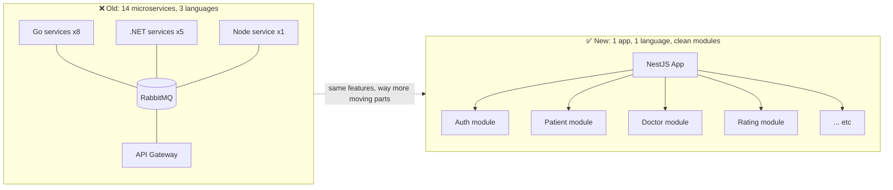

---

## 🛠️ New Tech Stack (simple version)

| Piece | What we use | Why |
|---|---|---|
| Backend | **Node.js + NestJS** (one app, organized into modules: Auth, Patient, Doctor, Rating, etc.) | One language to learn/debug. NestJS naturally keeps code organized like separate services, without the deployment pain. |
| Database | **Postgres** (Supabase free tier) | One database, one connection. No cross-service data headaches. |
| Cache / live scores | **Redis** (Upstash free tier) | Fast doctor trust-score lookups |
| Background jobs (reminders, calls, notifications) | **BullMQ** (built on Redis) | Replaces RabbitMQ — one less moving part |
| Chat | **Socket.io** | Simple, well-documented, works out of the box |
| Video calls | **Jitsi** (free embed) | Don't build your own video signaling — just embed it |
| Voice-to-text / text-to-voice | **Web Speech API** (built into the browser, free) | Zero setup |
| Translation | **Google Translate free tier** or **LibreTranslate** | Same as before |
| Auth (login/OTP) | **Supabase Auth** or **Firebase Auth** | Don't build your own login system — huge time saver |
| Payments (donations) | **Razorpay test mode** | Same as before |
| Frontend | **One Next.js app** with sections `/patient`, `/doctor`, `/admin` | One app instead of three — easier to build and deploy |
| Deployment | **Docker Compose** (just the app + Postgres + Redis) | Simple `docker compose up` — no Kubernetes needed yet |

**One-line stack:** NestJS + Postgres + Redis + BullMQ + Socket.io + Jitsi + Next.js + Supabase Auth + Razorpay.

### System architecture (how the pieces actually connect)

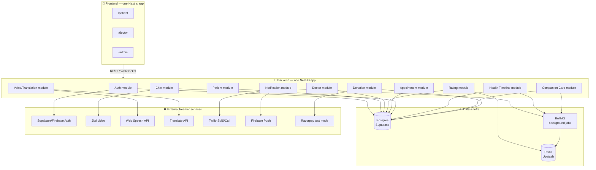

---

## ❌ What We're Cutting (for now)

These aren't "wrong" ideas — they're just **too early**. Add them later if the product actually grows and needs them.

- ~~API Gateway~~ — Next.js handles routing fine at this size
- ~~RabbitMQ~~ — BullMQ does the same job with less setup
- ~~Kubernetes~~ — Docker Compose is enough for a demo/early product
- ~~3 programming languages~~ — pick one, go deep
- ~~14 separate deployable services~~ — one app, organized folders

> When the product actually gets real traffic and a real team, *then* you pull pieces out into separate services — one at a time, only the ones that actually need it (probably Chat/Video first, since real-time stuff scales differently).

---

## 📂 Simple Folder Structure

```
swasth-darshan/
├── frontend/
│   └── app/                    # One Next.js app
│       ├── patient/
│       ├── doctor/
│       └── admin/
│
├── backend/
│   └── src/
│       ├── auth/
│       ├── patient/
│       ├── doctor/
│       ├── rating/
│       ├── appointment/
│       ├── chat/
│       ├── notification/
│       ├── health-timeline/
│       ├── companion-care/
│       ├── voice-translation/
│       └── donation/
│
├── docker-compose.yml          # app + Postgres + Redis, one command
└── docs/
    └── future-microservices.md # roadmap for later, not now
```

Every "service" from the old plan still exists — just as a **folder/module** instead of a **separate deployed app**.

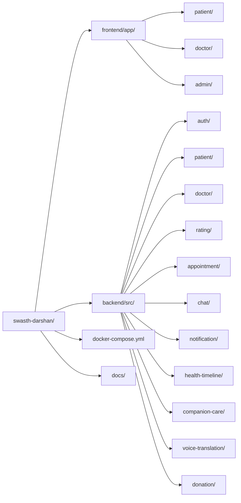

---

## 🔀 Core Flows (how each feature actually works)

### 1️⃣ Patient onboarding & voice-first symptom intake

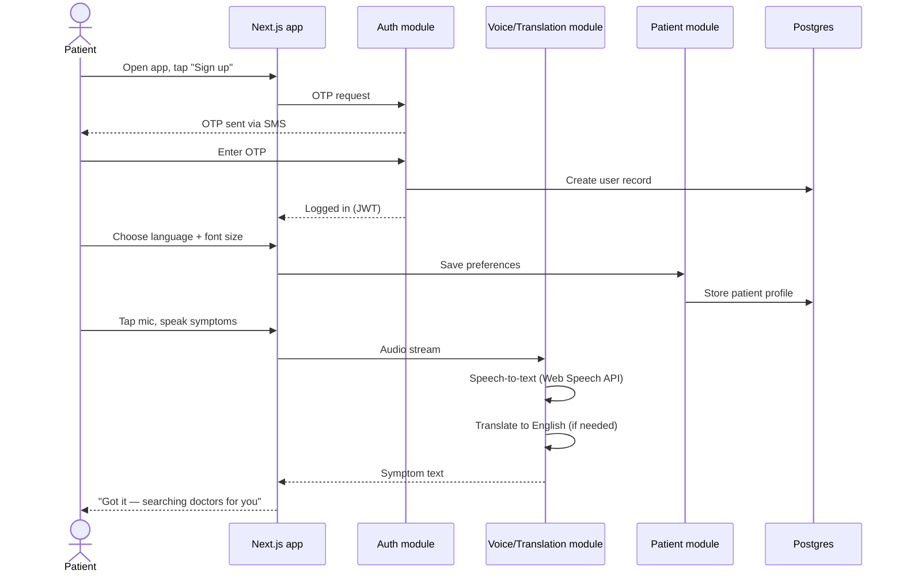

### 2️⃣ Doctor onboarding — "no fake records" verification

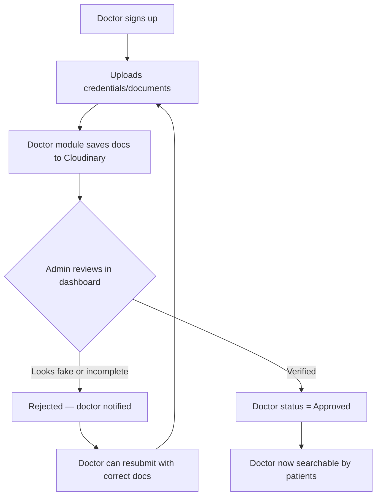

### 3️⃣ Real-time, unpaid doctor rating

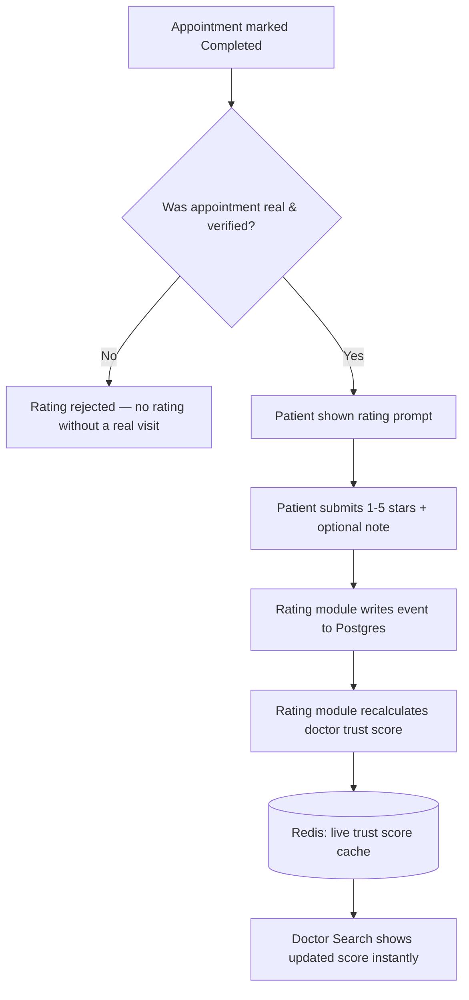

### 4️⃣ Philanthropy funding & transparency loop

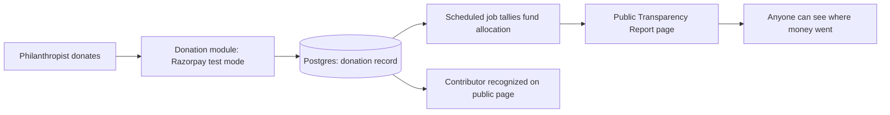

### 5️⃣ Companion care — "no loneliness" daily check-ins

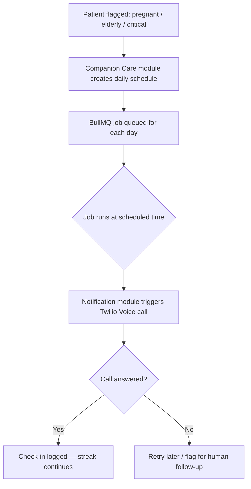

### 6️⃣ Health timeline & medicine reminders

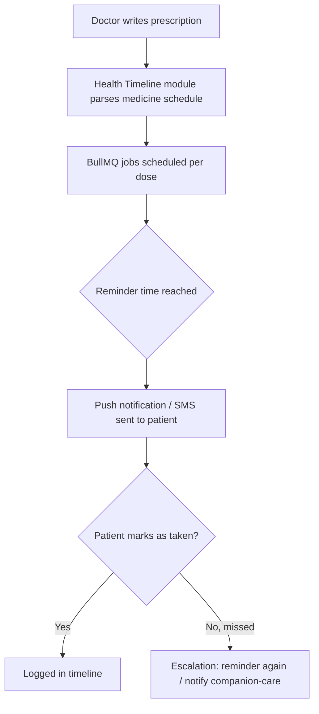

---

## 🗓️ 2-Month Plan (Simplified)

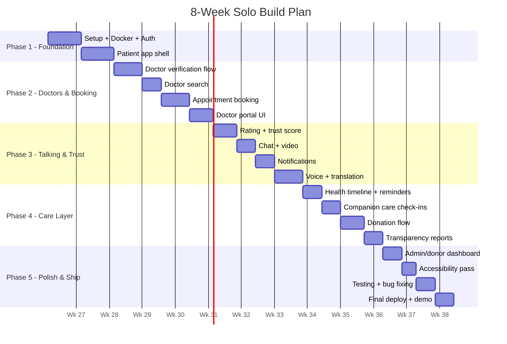

### Week 1–2: Foundation
- Set up Next.js + NestJS + Postgres + Docker Compose
- Supabase Auth: signup/login/OTP working
- Patient can sign up, pick language + accessibility settings
- **Milestone:** Patient can log in and see an empty dashboard, deployed live

### Week 3–4: Doctors & Booking
- Doctor signup + document upload + admin approval screen
- Doctor search (Postgres full-text search — no need for a separate search engine yet)
- Appointment booking, rescheduling, cancellation
- **Milestone:** A verified doctor can be found and booked

### Week 5–6: Talking & Trust
- Post-appointment-only ratings, live trust score (Redis)
- Chat (Socket.io) + Video (Jitsi embed)
- Notifications (Firebase push + Twilio SMS trial)
- Voice input + translation wired into patient app
- **Milestone:** Full loop works — search, book, talk, rate — in multiple languages

### Week 7: Care & Trust Features
- Medicine reminder scheduling (BullMQ)
- Companion care: flag patients, schedule daily check-in calls
- Donation flow (Razorpay test mode)
- Public transparency report page
- **Milestone:** "No loneliness" and "transparent funding" are real, working features

### Week 8: Polish & Ship
- Admin/donor dashboard
- Accessibility pass: big fonts, voice navigation, simple mode
- Bug fixes, load test, final deploy
- Record demo video
- **Milestone:** Live, working product — built solo, on time

---

## 🗄️ Simple Data Model (high level)

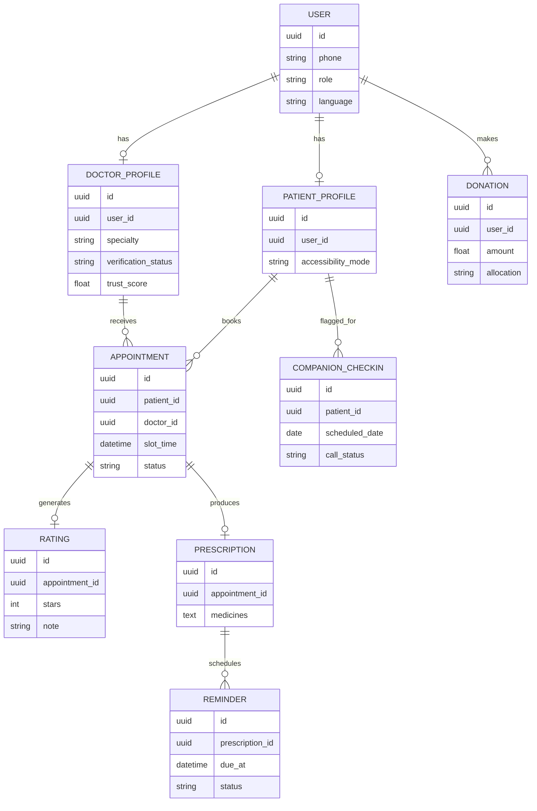

---

## 🎯 Guiding Principle

**Build it boring first. Make it fancy later — only if it needs to be.**

Every "advanced" idea from the original plan (multi-language microservices, message queues, API gateways, Kubernetes) is still valid — it's just saved for *after* the product proves people want it. Right now, the job is to ship something real that a patient in a village can actually use.

---

## 🚀 Later, If It Grows (optional roadmap)

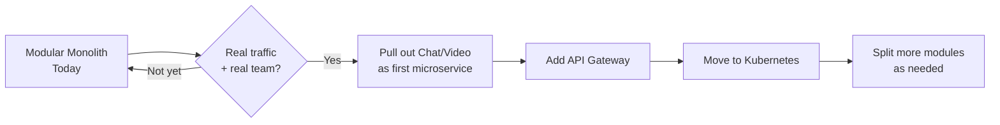

- [ ] Pull Chat/Video into its own service (first candidate — real-time load is different from the rest)
- [ ] Add a proper API Gateway once there's more than one frontend team
- [ ] Move to Kubernetes once you have real, sustained traffic
- [ ] Add DigiLocker doctor verification
- [ ] Offline-first PWA mode for low-connectivity areas

---

*Same mission. Same features. Just built the way one determined developer can actually finish it.*
